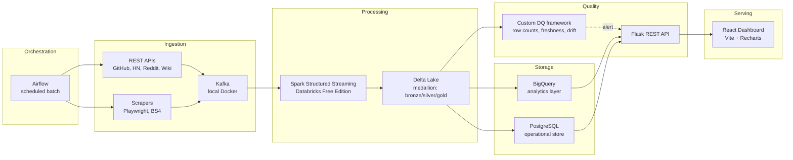

# Company Intelligence Aggregator

> Real-time + batch data acquisition platform that ingests public signals about companies — engineering activity, hiring, mentions, funding — and serves them through an analytics API and React dashboard.

Built end-to-end on free-tier infrastructure (Databricks Free Edition, BigQuery free tier, local Docker for Kafka & Postgres). No paid subscriptions required.

---

## What it does

Aggregates company intelligence from multiple public sources, computes engineering and hiring signals in real time, runs data quality checks, and surfaces insights through:

- A **Flask REST API** for programmatic access
- A **React dashboard** for browsing companies, signals, and alerts
- A **scheduled batch refresh** via Airflow for historical backfills
- **Real-time alerts** on funding mentions, hiring spikes, and competitor activity

### Sources

| Source | Method | What we extract |
|---|---|---|
| GitHub API | REST | Repo activity, contributor counts, language stats, release cadence |
| HackerNews API | REST | Company mentions, sentiment proxies, story rank |
| Reddit API | REST | Subreddit mentions, comment volume, sentiment |
| Wikipedia / Wikidata API | REST | Company metadata, founders, founding dates, HQ |
| Public job boards | Playwright scraping | Headcount signals, open roles, role types |
| Company websites | BeautifulSoup scraping | Funding news, press releases, blog activity |

---

## Architecture



---

## Tech stack

| Layer | Tech |
|---|---|
| Languages | Python 3.11+, JavaScript (React) |
| Data libs | pandas, numpy, PySpark |
| Scraping | Playwright, BeautifulSoup, Scrapy |
| Streaming | Apache Kafka, Spark Structured Streaming |
| Storage | Delta Lake (medallion: bronze/silver/gold), BigQuery, PostgreSQL |
| Orchestration | Apache Airflow |
| Backend | Flask, Pydantic |
| Frontend | React 18, Vite, Recharts |
| Data quality | Custom DQ framework (anomaly detection, freshness, schema drift) |
| DevOps | Docker Compose, GitHub Actions (CI/CD) |
| Cloud | Databricks Free Edition, BigQuery free tier |

---

## Repository structure

```
.
├── src/company_intel/
│   ├── scrapers/          # API clients + Playwright scrapers
│   ├── streaming/         # Kafka producers + Spark Streaming jobs
│   ├── batch/             # Airflow DAGs for scheduled refreshes
│   ├── storage/           # Delta, BigQuery, Postgres writers
│   ├── data_quality/      # DQ framework: checks + reporters
│   └── api/               # Flask app
├── frontend/              # React + Vite dashboard
├── tests/                 # pytest suite
├── docker-compose.yml     # Local Kafka, Zookeeper, Postgres
├── .github/workflows/     # CI/CD pipelines
├── pyproject.toml         # Python packaging
├── requirements.txt       # Pinned dependencies
└── .env.example           # Sample environment variables
```

---

## Quick start

### Prerequisites

- Python 3.11+
- Docker Desktop
- Node.js 20+ (for the React frontend)
- Databricks Free Edition account ([signup](https://www.databricks.com/learn/free-edition))
- Google Cloud account for BigQuery free tier ([signup](https://cloud.google.com/free))

### Local setup

```bash
# 1. Clone
git clone https://github.com/shambhavigupta11/company-intelligence-aggregator.git
cd company-intelligence-aggregator

# 2. Python env
python3.11 -m venv .venv
source .venv/bin/activate
pip install -r requirements.txt

# 3. Environment
cp .env.example .env
# edit .env with your API keys (GitHub PAT, Reddit creds, BigQuery service account)

# 4. Start local infra (Kafka, Zookeeper, Postgres)
docker compose up -d

# 5. Run a scraper end-to-end
python -m company_intel.scrapers.github_api --org databricks

# 6. Start the Spark Streaming job (local mode)
python -m company_intel.streaming.spark_streaming_job

# 7. Start the Flask API
python -m company_intel.api.app

# 8. Start the React dashboard
cd frontend && npm install && npm run dev
```

API serves at `http://localhost:5050`. Dashboard at `http://localhost:5173`.

---

## Data quality framework

The DQ framework runs on every batch and streaming write. Checks include:

- **Row count anomaly detection** — compares against rolling 7-day baseline; flags >3σ deviation
- **Freshness** — alerts when source data hasn't updated within expected SLA
- **Schema drift** — detects column additions, removals, or type changes
- **Null rate monitoring** — per-column null rate vs baseline
- **Referential integrity** — cross-table key validation

DQ failures publish to a Kafka topic that the API consumes and surfaces as dashboard alerts.

---

## Roadmap

- [x] **Phase 1 — Scaffold:** repo structure, README, Docker Compose, sample scraper running locally
- [ ] **Phase 2 — Pipeline:** end-to-end Spark Streaming job, BigQuery + Delta writes, DQ framework active
- [ ] **Phase 3 — Serving:** Flask API + React dashboard live, GitHub Actions deploying, demo video recorded
- [ ] **Phase 4 — Polish:** Airflow DAGs scheduled, alerting via Kafka, integration tests

---

## License

MIT — see [LICENSE](LICENSE).
